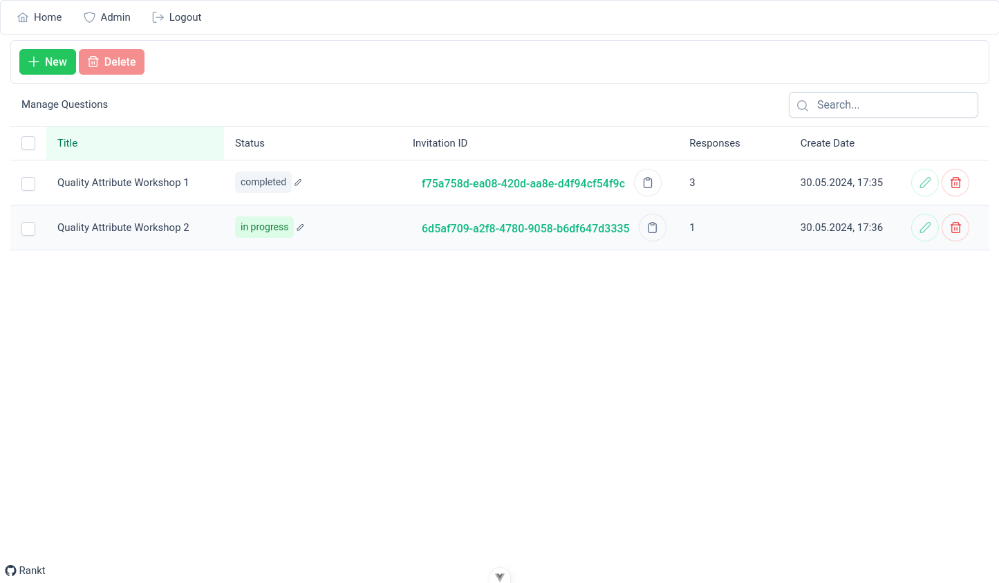
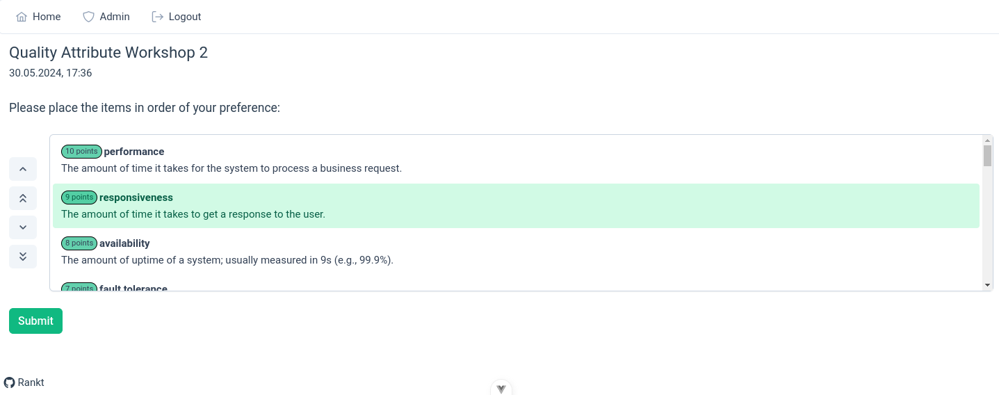
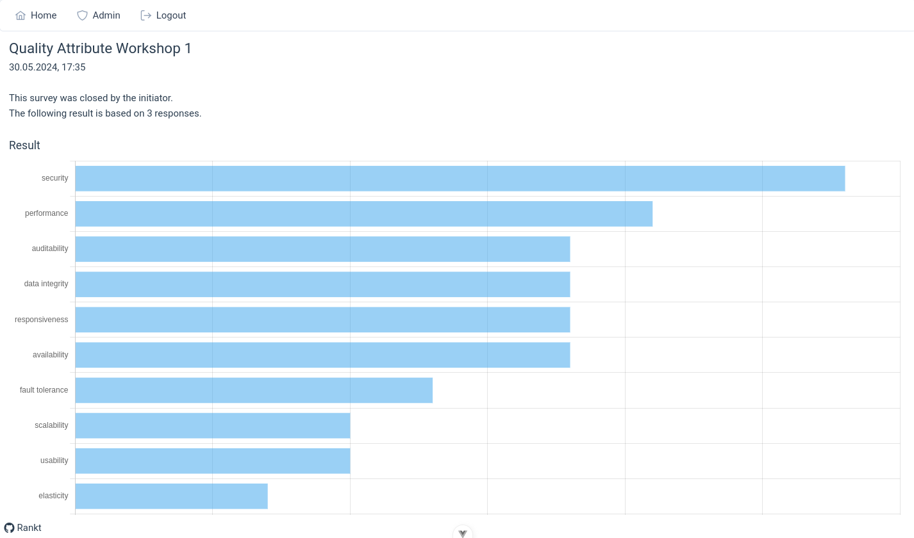
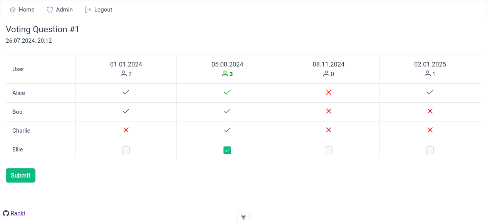
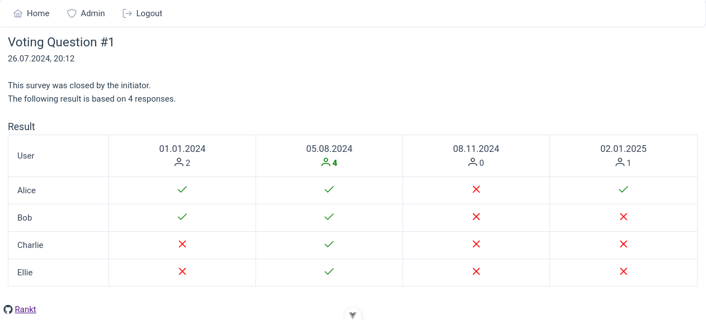

# :postbox: Rankt

Simple application for creating and executing surveys.

## Status

This application started as a learning project for me to get familiar with some new [Vue 3](https://vuejs.org/)
features, [PrimeVue](https://primevue.org/), ASP.NET Identity and some other features I wanted to try out.

There are still many features that are missing (
see [Feature wishlist](#feature-wishlist) / [Documentation](#documentation)) or need to be refactored / cleaned up.

If you want to contribute, feel free to create a pull request or an issue to talk about the change you want to make to
ensure that you do not waste your time when implementing it.

## Getting started

Once you have cloned this repository, you can simply run `docker compose up` and go to http://localhost:5253/.  
You can find the dev-credentials (admin/admin) in the `docker-compose.yml` file of this repository.

If you want to run this application without docker, you can just execute `dotnet run` and go to https://localhost:7151/
or https://localhost:7151/swagger, if you are interested in the OpenAPI documentation.

## Preview (beta - 26.07.2024)

### Admin

<kbd></kbd>

### Ranking Question

<kbd></kbd>

### Ranking Question Result

<kbd></kbd>

### Voting Question

<kbd></kbd>

### Voting Question Result

<kbd></kbd>

## Documentation

### UCs

- As an administrator I want to use the application without setting up external systems (like an IdP) to keep things
  simple.
- As an administrator/editor I want to log in so that I can manage (view/create/edit/delete) ranking surveys.
- As an administrator I want to complete ranking surveys so that the users can see the final result with their
  invitation link / id.
- As a user I want to join polls without a registration in order to save time and effort.
- As a user I want to vote on ranking surveys by ranking the options so that they represent my preference.
- As a user I want to see the result as soon as it is available to stay informed.

### Most important quality attributes

| Name            | Description                                                                                                                                                                                 |
|-----------------|---------------------------------------------------------------------------------------------------------------------------------------------------------------------------------------------|
| operability     | Degree to which a product or system has attributes that make it easy to operate and control.                                                                                                |
| deployability   | The amount of ceremony involved with releasing the software, the frequency in which releases occur, and the overall risk of deployment.                                                     |
| usability       | The capacity of a system to provide a condition for its users to perform the tasks safely, effectively, and efficiently while enjoying the experience on **mobile and on desktop clients**. |
| confidentiality | The ability of the system to restrict access to sensitive information or functionality.                                                                                                     |

### (Initial) Decisions

| Affected QAs                 | Description                                                                                                                                                                                                                            |
|------------------------------|----------------------------------------------------------------------------------------------------------------------------------------------------------------------------------------------------------------------------------------|
| deployability                | The application should be deployed as Docker container with easy-to-configure environment variables so that users can run it without additional effort.                                                                                |
| operability                  | The admin username and password should be configurable in the docker-compose.yml. The password must be changeable via environment variables.                                                                                           |
| operability, confidentiality | The application should use ASP.NET identity with a lightweight SQLite database so that it does not require external services/systems like an OAuth identity provider and is still using trusted standard solutions for those concerns. |
| confidentiality              | Only the administrator should be able to list and manage surveys without having an invitations link / id.                                                                                                                              |
| confidentiality              | Unauthenticated users must only be able to join a survey with a invitation link / id as long as the survey isn't archived.                                                                                                             |
| confidentiality              | In order to reduce the brute-force attack risk, the ASP.NET rate limiting middleware should be used.                                                                                                                                   |
| usability                    | The user should get a modern looking Vue3 frontend that is limited to joining a survey and voting with a straight-forward interface for mobile and desktop clients.                                                                    |

### Stakeholders

| Name       | Description                                                                                                                                                                                                                                                                                                |
|------------|------------------------------------------------------------------------------------------------------------------------------------------------------------------------------------------------------------------------------------------------------------------------------------------------------------|
| User       | Wants to participate in polls on their desktop or mobile devices without going through a registration process or additional overhead. Prefers the app to be straight-forward and to just get the job done.                                                                                                 |
| Admin      | Has to regularly conduct ranking surveys and wants to have a self-hostable solution, that is easy to use and set up. Although the survey data is not confidential, he wants to have basic security measures in place and wants to restrict the functionality of unauthenticated users as good as possible. |
| Operations | Wants to include this application in their existing docker environment without bothering too much about the technology the application is written in.                                                                                                                                                      |

### Assumptions

- This app is not dealing with much data, since only the administrator can manage polls.
- Although the poll options are secured to some extent (invitation IDs, rate limiting,...), they are treated to not be
  business-critical. This could change in the future, but this is very unlikely. The registration barrier for survey
  participation was dropped in favor of the overall usability.

### Security measures

- Rate limiting.
- ASP.NET Identity authentication.
- Limiting the amount of possible survey responses.
- Only showing active surveys to users.
- Generic error messages
- Encouraging the admin to change his password frequently (reminder).
- Deleting a survey deletes the data completely from the database and not just from the UI.

### Views

#### Homepage

The homepage should inform the user what the application is about and provide the option to join an existing survey.

#### Voting page

This is the most important page of the application. Once the user joined via an invitation link / id, he should see
all the possible options and be able to rank them to his preferences.

There should be a button to commit the selection (e.g., "Submit") that leads the user to the "result" page.

#### Result page

This page polls the status from an API to check whether the admin closed the survey and the results are available.  
If that's the case, the user will get the result.

#### Login page

This page is only for administrators. It should allow the admin to log in via the standard ASP.NET Identity mechanisms (
including rate limiting) and forward him to the management page, if the login was successful.

#### Admin page

Should allow the admin to manage (add/edit/delete) all of his surveys.  
Furthermore, he should also be able to change his password and log out.

### Rules

- A survey is only visible to unauthenticated users with an invitation id, if it is still active (open/done).
- Survey options can not be changed once the survey was published.
- Surveys can only be closed by the initiator.

### Feature wishlist

- Other types of surveys / polls, like an appointment planner / date finder.
- Define templates in the `appsettings.json` file. Those templates should be selectable when creating surveys.
- Being able to export the result and (maybe) get it into a Markdown wiki.
- Option to dismiss a survey option entirely (e.g., if it is not important = 0 points)
- "Confidential type": Define whether users should be able to see which user has voted which option.
- E2E tests similar
  to [Chrono's E2E tests](https://github.com/philipp-meier/Chrono/blob/main/src/Chrono.Tests/E2E/00_E2ETestBase.cs).
- Remove the `TODO`s.
- Improve
  the [QuestionOptionEditList](https://github.com/philipp-meier/Rankt/blob/main/ClientApp/src/components/QuestionOptionEditList.vue)
  and make it more user-friendly and responsive.

